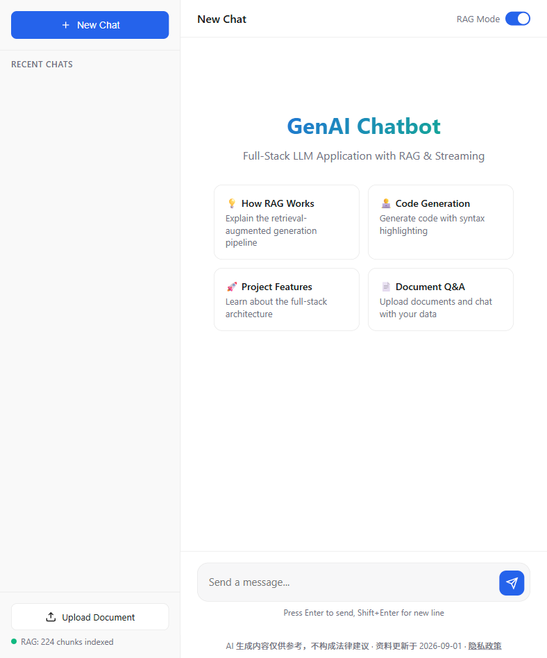

# Policy Advisor | 留学生 CPT/OPT 签证政策助手

[](https://policy-advisor-1fd6.onrender.com)
[](https://python.org)
[](https://fastapi.tiangolo.com)
[](https://langchain.com)
[](LICENSE)

**🌐 Live demo: [policy-advisor-1fd6.onrender.com](https://policy-advisor-1fd6.onrender.com)** (free tier — first visit may take ~60s to wake up)



An AI advisor specialized in **US student visa work authorization (CPT / OPT / STEM OPT)**, built by productizing my general-purpose RAG platform into a vertical-domain product. It answers Chinese-speaking international students' policy questions grounded in **official sources only** (USCIS / ICE / university ISSO pages), with every answer carrying **source citations and policy freshness dates**, and a hard compliance boundary: out-of-corpus questions are refused, and every reply includes a "not legal advice" disclaimer.

> **Origin story**: This product's RAG foundation (FastAPI + SSE streaming, hybrid retrieval + reranking, evaluation framework) comes from my general-purpose chatbot project `chat_robot` (MIT). Instead of starting over, I'm evolving my own system into a product — the full roadmap lives in [docs/PRODUCTIZATION_PLAN.md](docs/PRODUCTIZATION_PLAN.md).
<!-- TODO: 待用户在 GitHub 建立 chat_robot 远程仓库后，将 `chat_robot` 替换为实际仓库链接 -->

---

## 🎯 Why a Vertical Product

Three problems a generic RAG chatbot cannot solve for immigration policy:

1. **Cross-language retrieval** — The corpus is English official documentation; users ask in Chinese. Instead of swapping in a multilingual embedding model, Chinese queries are translated to English before retrieval (Phase 2.1) — policy terms (OPT/CPT/SEVIS/I-20) translate with near-zero risk, and the proven index needs no migration.
2. **Policy freshness** — Immigration rules change frequently. Every retrieved chunk carries `source_url` + `crawl_date` metadata, and answers surface "information as of {date}, refer to USCIS for the latest".
3. **Compliance red line** — Answers must never pretend to be legal advice; out-of-domain questions are refused and redirected.

---

## ✨ Current Capabilities

- **Streaming Responses (SSE)** — Token-by-token output, ChatGPT-like typing effect
- **Multi-Session Support** — Isolated conversation threads with auto-generated titles, persisted in SQLite
- **Auth & Guest Funnel** — JWT-based auth; anonymous guests get 5 free messages, then a one-tap email login
- **Rate Limiting & Cost Observability** — per-IP limit on the LLM endpoint (slowapi); daily token-usage tracking with budget alerts
- **Document Upload** — PDF / TXT / DOCX with extension whitelist, size cap, and path-traversal-safe renaming
- **Three-arm Retrieval** — dense vector, BM25+RRF hybrid, and hybrid + cross-encoder rerank; A/B measurable via the evaluation suite
- **Citations with Freshness** — every answer carries source cards (official URL + policy crawl date)
- **Compliance** — site-wide footer disclaimer, `/privacy` page, and corpus "last updated" date surfaced in the UI
- **CI/CD** — GitHub Actions runs tests + retrieval eval on every PR; merge to `main` auto-deploys to Render
- **Docker Deployment** — One-command startup with Docker Compose

## 🚧 Roadmap Status

| Phase | Scope | Status |
|---|---|---|
| 0 | Project initialization (new repo, baseline commit) | ✅ Done |
| 1 | Policy corpus pipeline (crawler + metadata ingestion) | ✅ Done |
| 2 | Vertical RAG: query translation, citations, refusal, policy eval set | ✅ Done |
| 3 | Productization: SQLite persistence, auth, rate limiting, cost tracking | ✅ Done |
| 4 | Deployment: Render + CI/CD | ✅ Done (custom domain & uptime monitor optional) |
| 5 | Compliance: footer disclaimer, privacy page, corpus freshness date | ✅ Done (corpus updates ongoing) |

---

## 🏗️ Engineering Highlight: Fitting a RAG App into 512MB

The production deployment runs on **Render's free tier (512MB RAM, no persistent disk)** — a constraint that killed the first three deploys with OOM. The fixes, layer by layer:

1. **ONNX embeddings instead of PyTorch** — swapped `sentence-transformers` for ChromaDB's built-in `ONNXMiniLM_L6_V2` (same all-MiniLM-L6-v2 weights, same 384-dim L2-normalized vectors, served by onnxruntime). Boot memory dropped from ~659MB to ~346MB, with **zero retrieval-quality loss** (Recall@3 = 0.906, verified by the eval suite against the torch baseline).
2. **Killing a stealth torch import** — `langchain_text_splitters`' package `__init__` eagerly imports sentence-transformers (hence torch) even when you only use the plain recursive splitter; a `sys.modules` stub blocks it.
3. **Build-time index baking** — the Docker build (which has ample RAM) pre-builds the vector index *into the image*; at runtime the startup hook sees a non-empty store and skips corpus embedding entirely, so the 512MB instance never pays the indexing memory spike.
4. **CPU-only torch wheel + batched embedding** — the CUDA-bundled wheel (~2GB of unused libs) is replaced by the CPU build, and `add_documents` embeds in batches of 32 to flatten peak RSS.

Deployment topology: GitHub push → Actions (pytest + eval gate) → Render Docker deploy (blueprint: `render.yaml`).

---

## 🚀 Quick Start

### Prerequisites
- Python 3.10+
- A DeepSeek API key (get one at [platform.deepseek.com](https://platform.deepseek.com))

```bash
git clone https://github.com/vebbbdg/policy-advisor.git
cd policy-advisor

conda create -n policy-advisor python=3.11
conda activate policy-advisor
pip install -r requirements.txt

cp .env.example .env   # add your DEEPSEEK_API_KEY

uvicorn main:app --reload --host 0.0.0.0 --port 8000
# open http://localhost:8000
```

Or with Docker:

```bash
docker-compose up -d
```

---

## 📁 Project Structure

```
policy-advisor/
├── main.py                 # FastAPI application entry point
├── core/
│   ├── model.py            # LLM init + ONNX/torch embedding backends + reranker
│   ├── memory.py           # Sliding window context management
│   ├── session.py          # Multi-session management
│   ├── db.py               # SQLite persistence layer
│   ├── auth.py             # JWT auth: guest tokens, login, user context
│   ├── usage.py            # Daily LLM token usage tracking & budget alerts
│   ├── rag.py              # RAG engine with ChromaDB (batched indexing)
│   ├── retrieval.py        # Tokenization / RRF fusion / rerank (pure functions)
│   ├── uploads.py          # Upload security validation
│   └── logger.py           # Structured logging
├── crawler/                # [Phase 1] Official policy page crawler → Markdown + metadata
├── data/policy_corpus/     # [Phase 1] Versioned corpus snapshots (git-tracked)
├── static/index.html       # Single-page web application
├── static/privacy.html     # [Phase 5] Privacy policy page
├── eval/                   # RAG evaluation framework (Recall@k / MRR / LLM-as-judge)
├── tests/                  # Unit tests (77 tests)
├── render.yaml             # Render blueprint (free-tier web service)
├── .github/workflows/ci.yml  # CI: pytest + retrieval eval on every PR
└── docs/PRODUCTIZATION_PLAN.md  # Full productization roadmap
```

---

## 🧪 Evaluation

The project ships a self-contained evaluation framework (`eval/`) measuring retrieval and generation quality separately, on an isolated vector store. Improvements are accepted or rejected by data, not intuition — this methodology gates every Phase 2 change (e.g., the query-translation approach is validated against a Chinese policy QA set before any multilingual embedding switch would even be considered).

```bash
# Retrieval metrics only (no API cost)
python -m eval.run_eval

# A/B: dense vs hybrid (BM25+RRF) vs hybrid + cross-encoder rerank
python -m eval.run_eval --retriever dense|hybrid|rerank

# Retrieval + generation + LLM-as-judge (needs DEEPSEEK_API_KEY)
python -m eval.run_eval --judge
```

---

## ⚖️ Disclaimer

All content produced by this assistant is for informational purposes only and **does not constitute legal advice**. For major decisions, consult your school's DSO (Designated School Official) or a qualified immigration attorney. Always refer to [USCIS](https://www.uscis.gov) for the latest policies.

---

## 📝 License

MIT — inherited from the baseline project.

---

## 👤 Author

Built as a portfolio project for AI Software Engineer applications.

**Tech Stack Keywords for Resume:**
`Python` `FastAPI` `LangChain` `RAG` `LLM` `ChromaDB` `ONNX Runtime` `Multilingual Retrieval` `SSE Streaming` `JWT Auth` `SQLite` `Docker` `GitHub Actions CI/CD` `Render` `Policy Domain QA`
